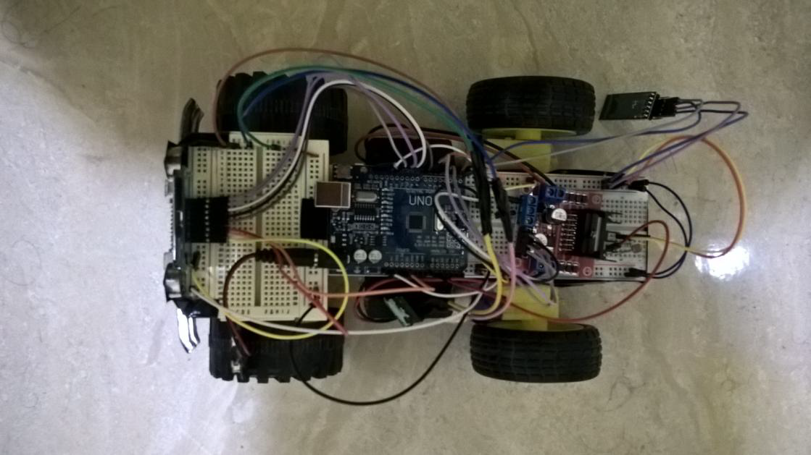
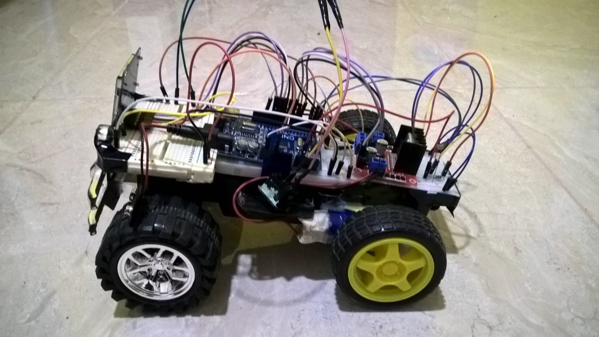
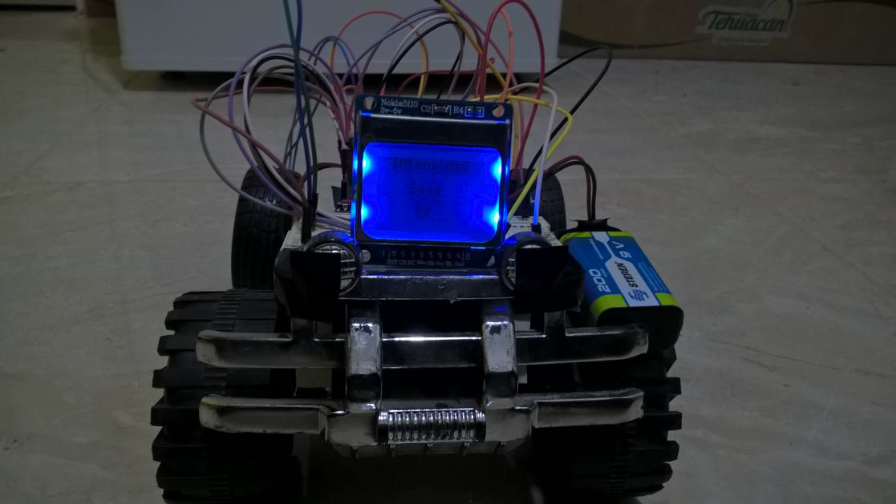

# Carro de Control Remoto
El proyecto consiste en un carro a control remoto con velocidades que cuenta con un módulo bluetooth conectado a través del cual se comunican las instrucciones de movimiento por medio del acelerómetro de un teléfono celular con sistema operativo Android. Las acciones que puede realizar el carro son: avanzar, detener, reversa, girar izquierda o derecha y cambiar de velocidad. Además, se cuenta con una fotorresistencia de la cual se transmite su valor por bluetooth al teléfono y se almacena en una base de datos cada segundo. También se cuenta con una pantalla LCD en la que se indica la intensidad de luz captado de acuerdo al valor leído por la fotorresistencia. Por último se incluye un switch para encender y apagar el carro a control remoto. Los materiales utilizados se muestran a continuación:

1. Arduino UNO con microcontrolador ATmega328P
2. Fotorresistencia
3. Puente H - L298N
4. 2 Motorreductores
5. Módulo Bluetooth HC05
6. Pantalla LCD Nokia 5110
7. Batería recargable de 9V
8. Switch
9. 2 Protoboards
10. Cables Dupont

## Desarrollo
Para poder utilizar los diferentes módulos que se conectaron al microcontrolador se realizó la configuración de cada uno de ellos de la siguiente forma:

### Interrupciones externas
Para utilizar el switch de encendido y apagado del carro se utilizó la interrupción externa 0. La interrupción se configuró para que se genere cuando se detecte un flanco de subida tal como se muestra en el archivo [IntExt.h](src/IntExt.h).

### Timers
Para leer del ADC un valor cada segundo se utilizó el Timer1. Esta configuración genera una interrupción cuando el timer coincida con el valor del registro OCR1A. Si consideramos que el tiempo en el que se genera una interrupción es igual a Preescalador/(Frecuencia de Oscilador / Valor en OCR1A) utilizando un preescalador de 1024 y un valor de 15624 en OCR1A más los 16MHz a los que trabaja el Arduino obtenemos 1 segundo. Además, se tiene una función para apagar el timer (véase [Timer.h](src/Timer.h)).

### PWM
El PWM se configuró de una forma básica sin preescalador, en modo no invertido y Fast PWM. La señal se generó con el Timer0. Inicialmente se asigna un valor de 0 al registro OCR0A para obtener un ciclo de trabajo del 0% por lo que al encender el carro, debería quedarse sin movimiento. Así mismo, se incluye la función de apagado del PWM (véase [PWM.h](src/PWM.h)).

### ADC
La entrada del ADC que se tomó es PC1, en el Arduino UNO el pin en el que se conectó la fotorresistencia es A1. Aunque se pueden generar interrupciones para iniciar las conversiones de forma automática, en este caso se optó por hacerlas de forma “manual” debido a que la lectura solamente se realizará cuando el Timer1 indique que ha pasado 1 segundo (véase [ADC.h](src/ADC.h)).

### USART
Para realizar la comunicación serial de la computadora o teléfono celular con el carro por bluetooth se configuró la USART en modo asíncrono, sin bit de paridad, baudrate de 9600 y datos de 8 bits. También se habilitó la interrupción por fin de recepción. Además, se incluyó la función de transmitir para poder realizar echo en caso de ser necesario y una función para apagar la USART (véase [USART.h](src/USART.h)).

### SPI
Para el manejo de la pantalla LCD a través de comunicación LCD se utilizó el siguiente [código](http://echachik.blogspot.mx/2014/09/nokia-5110-lcd-display-avr.html) el cual no requiere instalar ninguna librería externa. Para conectar la pantalla LCD se utilizaron 4 salidas del puerto B del ATmega328P.

### Motor
El control del carro se realizó con diferentes configuraciones de las señales de control de los dos motores, y el cambio de velocidades se realizó modificando el ciclo de trabajo del PWM a través del registro OCR0A. Las señales de control que se utilizaron fueron 3, la primera de ellas fue la salida del PWM que se conectó a los dos motores y las otras dos señales fueron salidas digitales, una para cada motor. Dependiendo de la instrucción recibida (cada instrucción es de un carácter) se realiza un movimiento o cambio de velocidad. En el archivo [Motor.h](src/Motor.h) se muestran los movimientos permitidos y las instrucciones para ejecutarlo.

## Configuración general
Los pines utilizados del Arduino fueron: 0 y 1 para módulo bluetooth; 2 para switch de encendido y apagado; 5,6 y 7 para el control de motorreductores; 8,9,10,11 y 12 para pantalla LCD y A1 para la fotoresistencia. Cuando se enciende el carro a través de la interrupción externa se llama a la función system_setup que llama a todas las funciones de configuración de los módulos definidas anteriormente y cuando se apaga se llama a las funciones definidas que se deshabilitan a los módulos. De esta forma, considerando las configuraciones hechas, al encender el carro, se debe ver la intensidad de luz y el valor devuelto por la fotorresistencia en la LCD y el carro se moverá de acuerdo a la posición en la que se encuentre el teléfono que sirva como control (véase [main.c](src/main.c)).

## Interfaz de usuario
Para controlar el carro de forma remota se desarrolló una aplicación para sistema operativo Android con la herramienta [MIT App Inventor](http://ai2.appinventor.mit.edu) la cual permite la programación de aplicaciones móviles de forma gráfica a través de bloques. La app desarrollada utiliza el acelerómetro del teléfono celular para enviar las instrucciones al microcontrolador, de esta forma, si se desea que el carro avance se deberá inclinar el teléfono hacia adelante, por el contrario, si se desea que el carro vaya en reversa el teléfono deberá inclinarse hacia atrás. Lo mismo sucederá para hacer giros hacia la izquierda y derecha por lo que para detener el movimiento del carro el teléfono deberá estar acostado en una posición de 180 grados. Dependiendo de la inclinación del teléfono se mostrará en verde la dirección en la que se esté moviendo, así mismo cuando avance podrá cambiar la velocidad presionando en cualquiera de los 3 botones de la sección Velocidad. Por otro lado, para ver los valores leídos por la fotorresistencia que se han almacenado en la base de datos presione el botón Mostrar en la última sección de la interfaz y se desplegará una lista con los niveles de intensidad de luz.

## Imágenes

